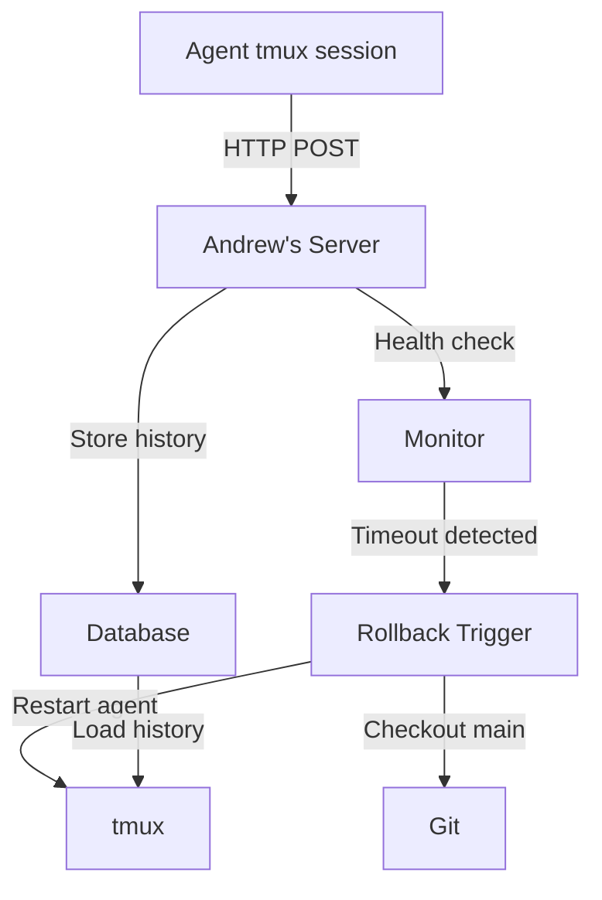
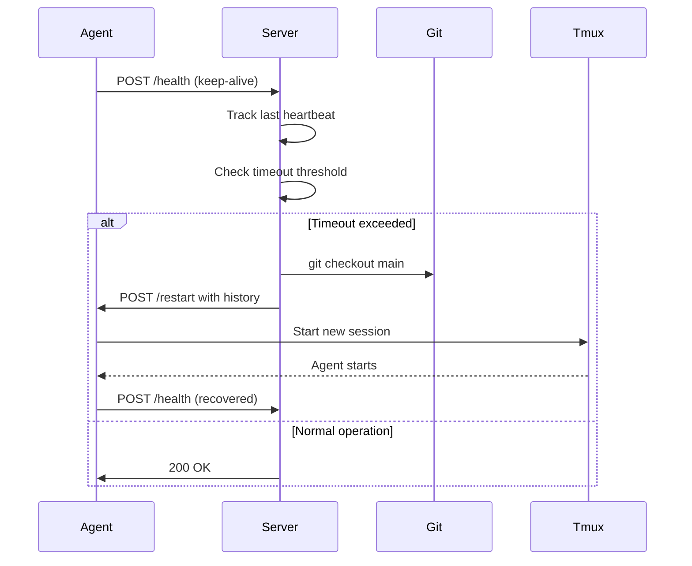
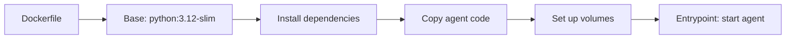
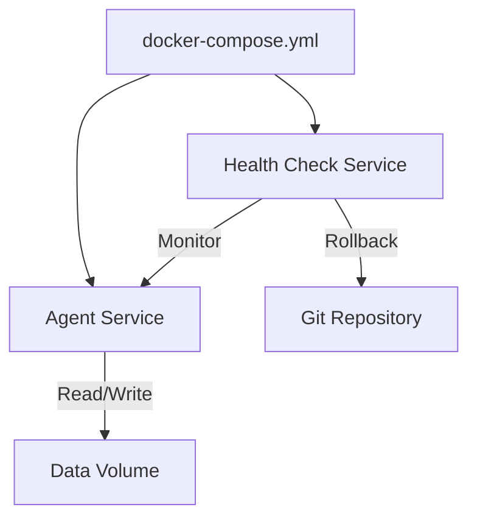
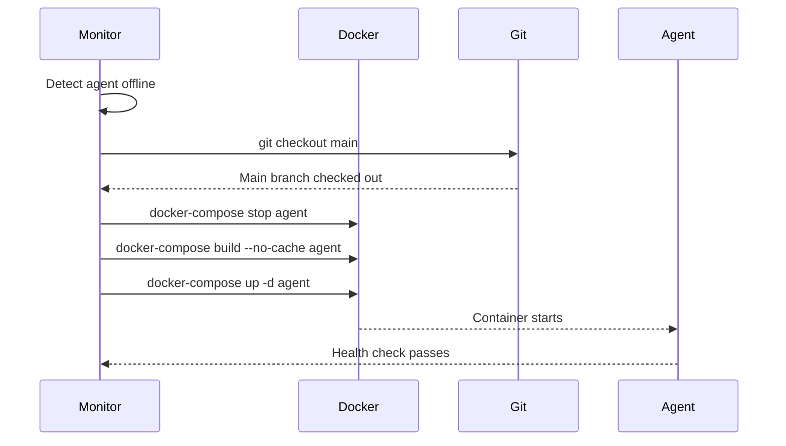

# Self-Modification Protocol

## Goal
Modify the agent's source code safely, restart the server, and maintain rollback capability.

## Current State
- Agent runs in tmux
- Git repository initialized with one commit
- No remote configured

## Constraints
- Must rollback on failure
- Must preserve conversation history
- Must maintain continuity of work
- Agent process stops when tmux dies - this is unavoidable

## Key Insight: State Loss During Restart

When tmux session is killed:
- Agent process stops completely
- In-memory state (chat history) is lost
- No way to "gracefully" restart without losing context

Therefore, any restart must:
1. Save current state BEFORE shutdown (current task, pending work)
2. Restart and reload state
3. Verify system health before resuming

## Proposed Plan

### 1. Branch Strategy
- Every modification gets its own branch: `feature/` or `hotfix/`
- Main branch is always stable/production
- PR-style review before merge (even if self-review)

### 2. Pre-Modification Steps
1. Create new branch from main
2. Document changes in commit message
3. Test changes in isolated environment if possible
4. Save current state (git tag, branch backup)
5. **Write current_task.md with pending work and conversation context**

### 3. State Persistence Strategy
Before any restart:
1. Write `current_task.md` with:
   - Current task/objective
   - Last few messages of conversation
   - Any pending actions
   - State of any long-running operations
2. Save conversation history to file (if applicable)
3. Document any open questions or decisions pending

### 4. Modification Process
1. Checkout new branch
2. Make changes
3. Commit with descriptive message
4. Test locally (if CLI) or in detached tmux session
5. If successful, merge to main
6. If failed, rollback to previous state

### 5. Restart Strategy
- Create `restart_agent.sh` script that:
  - Saves tmux session state
  - **Writes current_task.md with context**
  - Saves conversation history
  - Kills current tmux session
  - Starts new tmux session with agent
  - **Reloads current_task.md on startup**
  - Restores conversation history if possible

### 6. Rollback Plan
- If new code fails:
  - Kill new tmux session
  - Checkout previous commit/branch
  - Restart agent with `restart_agent.sh`
  - Verify functionality
  - Restore conversation history

### 7. Safety Mechanisms
- Pre-commit hooks to prevent obvious errors (syntax check, lint)
- Unit tests for critical components
- Health check endpoint before full deployment
- Automatic rollback on health check failure
- `roll_back.sh` script that:
  - Checks out previous commit
  - Restores previous state files
  - Restarts agent

### 8. Current Task Tracking
- `current_task.md` - Write before shutdown, read on startup
- Format:
  ```
  # Current Task
  [Objective]

  ## Conversation Context
  [Last N messages or key points]

  ## Pending Actions
  - [ ] Task 1
  - [ ] Task 2

  ## State
  [Any relevant state information]
  ```

## Implementation Steps

1. Create `restart_agent.sh` script that:
   - Saves current_task.md
   - Saves conversation history
   - Manages tmux sessions
2. Create `roll_back.sh` script
3. Set up pre-commit hooks (syntax check, lint)
4. Add loading logic to CLI to read current_task.md on startup
5. Document the process in this file

## Open Questions

1. Should we use git tags for versioning releases?
2. How to handle state persistence during restarts?
3. Should we have a staging branch for testing?
4. What level of testing should happen before merge?
5. How to preserve long conversation history across restarts?

## New: Server-Based Recovery System

Andrew will build a server with the following capabilities:

### Health Check Endpoint
- Lightweight HTTP endpoint to store and retrieve conversation histories
- Tracks agent uptime and detects offline periods
- Auto-trigger rollback if offline for too long

### Rollback Trigger
- Monitors agent health via HTTP endpoint
- If agent goes offline beyond threshold:
  1. Rollback to main branch
  2. Restart agent with saved conversation history
  3. Resume from last known state

### Architecture



### Rollback Flow



## Docker Integration

Moving the agent to Docker provides:

### Benefits
- **Isolation**: Agent runs in container, separate from host
- **Reproducibility**: Same environment everywhere
- **Easy rollback**: Revert to previous image tag
- **State persistence**: Volumes for history, configs, current_task.md
- **Service management**: Docker Compose for orchestration

### Dockerfile Structure



### Volume Mounts
- `/agent/data` - Conversation histories, current_task.md
- `/agent/config` - .env, secret.env
- `/agent/.git` - Git repository (for branch management)

### Docker Compose



### Rollback with Docker


